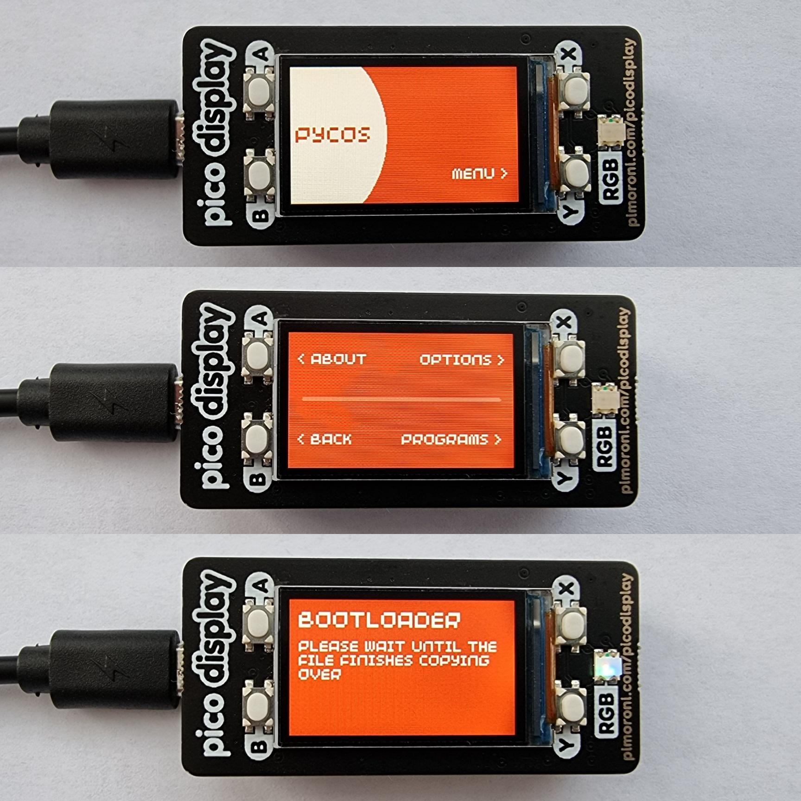

# PycOS

An open source operating system (mostly just a GUI) designed primarily for the Raspberry Pi Pico, written entirely in MicroPython.

"PycOS" is an combination of the words Python, Pico and OS.

**Currently in a semi-working state, with some incomplete features.**

## Overview

### Features

* Support for custom themes
* Dedicated configuration file
* Overclocking/underclocking support
* Quick access to bootloader
* Support for custom scripts

### Future plans

* Further UI improvements
* More customisation options
* Improved scripting support
* Desktop client for easy interfacing with the device

## Requirements

### Hardware requirements

* [Compatible display](#compatibility)
* [Compatible board](#compatibility)
* USB data cable

### Software requirements

* [rshell](https://pypi.org/project/rshell/)
* [mpy-cross](https://pypi.org/project/mpy-cross/)

## Compatibility

| Displays | Compatible? | Notes |
|---|---|---|
| [Pimoroni Pico Display Pack](https://shop.pimoroni.com/products/pico-display-pack) | Yes (tested) | |
| [Pimoroni Pico Display Pack 2.0](https://shop.pimoroni.com/products/pico-display-pack-2-0) | No | Requires a different display module to work and UI elements are not fully optimised |

| Boards | Compatible? | Notes |
|---|---|---|
| [Raspberry Pi Pico](https://www.raspberrypi.com/products/raspberry-pi-pico/) | Yes (tested) | |
| [Pimoroni Pico LiPo (4MB)](https://shop.pimoroni.com/products/pimoroni-pico-lipo?variant=39386149093459) | Yes | Similar to the 16MB variant, so most likely works |
| [Pimoroni Pico LiPo (16MB)](https://shop.pimoroni.com/products/pimoroni-pico-lipo?variant=39335427080275) | Yes (tested) | |

| Firmware | Compatible? | Notes |
|---|---|---|
| [Version 1.18.7](https://github.com/pimoroni/pimoroni-pico/releases/tag/v1.18.7) | Yes (tested) | |
| **Legacy** | | |
| [Version 0.3.x (MicroPython v1.17)](https://github.com/pimoroni/pimoroni-pico/releases/tag/v0.3.3) | Yes (tested) | |
| [Version 0.2.x (MicroPython v1.15/v1.16)](https://github.com/pimoroni/pimoroni-pico/releases/tag/v0.2.7) | Yes (tested) | |

## Installation

Ensure your board is running compatible firmware and is detected by `rshell`.

1. Clone the repository

        git clone https://github.com/Coosta6915/PycOS.git

2. Change directory into `pycos/src/`

        cd PycOS/pycos/src/

3. Use `rshell` to synchronise the board with the currect directory

        rshell rsync --mirror . /pyboard

## Images

