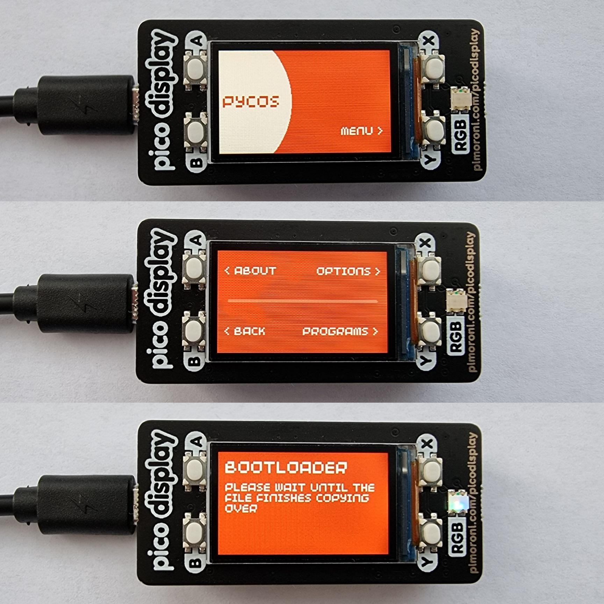

# PycOS

An open source operating system designed primarily for the Raspberry Pi Pico, written entirely in MicroPython.

"PycOS" is an combination of the words Python, Pico and OS.

## Overview

### Features

* Clean and intuitive UI
* Support for custom themes
* Dedicated configuration file
* Overclocking/underclocking support
* Quick access to bootloader
* Custom boot file support
* Support for user-written scripts

### Future plans

* More customisation options
* Further UI improvements
	* Enhanced and more visually appealing UI
	* Cleaner and more efficient implementation of the UI
* Improved scripting support
* Desktop client for easy interfacing with the device

## Compatibility

| Displays | Compatible | Notes |
|---|---|---|
| [Pimoroni Pico Display Pack](https://shop.pimoroni.com/products/pico-display-pack) | Yes (tested) | Everything functions correctly |
| [Pimoroni Pico Display Pack 2.0](https://shop.pimoroni.com/products/pico-display-pack-2-0) | No (working on compatibility)| Requires a different display library to work and UI elements are not fully optimised |

| Boards | Compatible | Notes |
|---|---|---|
| [Raspberry Pi Pico](https://www.raspberrypi.com/products/raspberry-pi-pico/) | Yes (tested) | Everything functions correctly |
| [Pimoroni Pico LiPo](https://shop.pimoroni.com/products/pimoroni-pico-lipo) | Yes (not tested) | The form factor of the board is similar to the standard Raspberry Pi Pico and the microcontroller is the same, so it *should* be compatible |

| Firmware | Compatible | Notes |
|---|---|---|
| [Version 0.3.0 (MicroPython v1.17)](https://github.com/pimoroni/pimoroni-pico/releases/tag/v0.3.0) | Partially (tested) | rshell sometimes cannot copy files onto the board |
| [Version 0.2.7 (MicroPython v1.16)](https://github.com/pimoroni/pimoroni-pico/releases/tag/v0.2.7) | Yes (tested) | Everything functions correctly |
| [Version 0.2.6 (MicroPython v1.16)](https://github.com/pimoroni/pimoroni-pico/releases/tag/v0.2.6) | Yes (tested) | Everything functions correctly |
| [Version 0.2.5 (MicroPython v1.16)](https://github.com/pimoroni/pimoroni-pico/releases/tag/v0.2.5) | Yes (tested) | Everything functions correctly |
| [Version 0.2.4 (MicroPython v1.16)](https://github.com/pimoroni/pimoroni-pico/releases/tag/v0.2.4) | Yes (tested) | Everything functions correctly |
| [Version 0.2.3 (MicroPython v1.16)](https://github.com/pimoroni/pimoroni-pico/releases/tag/v0.2.3) | Yes (tested) | Everything functions correctly |
| [Version 0.2.2 (MicroPython v1.15)](https://github.com/pimoroni/pimoroni-pico/releases/tag/v0.2.2) | Yes (tested) | Everything functions correctly |
| [Version 0.2.1 (MicroPython v1.15)](https://github.com/pimoroni/pimoroni-pico/releases/tag/v0.2.1) | Yes (tested) | Everything functions correctly |
| [Version 0.2.0 (MicroPython v1.15)](https://github.com/pimoroni/pimoroni-pico/releases/tag/v0.2.0) | Yes (tested) | Everything functions correctly |

## Requirements

### Hardware requirements

* USB data cable
* [Raspberry Pi Pico](https://www.raspberrypi.com/products/raspberry-pi-pico/) (or any other compatible board)
* [Pimoroni Pico Display Pack](https://shop.pimoroni.com/products/pico-display-pack) (or any other compatible display)

### Software requirements

* Python 3
* [rshell](https://github.com/dhylands/rshell) ([can be installed through PyPI](https://pypi.org/project/rshell/))

## Installation

**Make sure you are in the `src/` directory before starting.**

1. Connect the board to your computer in USB mass storage device mode (also referred to as bootloader mode) which can be done by holding down the `BOOTSEL` button on the board while plugging it in. The `BOOTSEL` button varies from board to board and may be be called something different on yours.
2. Flash [MicroPython with Pimoroni libraries](https://github.com/pimoroni/pimoroni-pico/releases) onto your chosen board. This is done by copying the UF2 binary onto the boards storage.
3. Check that [rshell](https://github.com/dhylands/rshell) recognises the board.

        rshell boards

3. Copy over `main.py` and `config.py` onto the board.

        rshell cp main.py config.py /pyboard

4. Reset the board (can be done by disconnecting and reconnecting it if yours does not have a reset button).

If everything was done correctly and without errors, PycOS should now be installed on the board.

## Usage

### MicroPython scripts

Currently the support for user-written programs is very restricted because of the limitation of MicroPython. Custom scripts can be prefixed with `Pp_` (stands for Pico program) and placed into the root directory for PycOS to recognise it as an executable program. The code must all be placed inside a `main()` function as that is what gets executed.

**Currently, there does not seem to be a way to update the display while PycOS is running a script.**

### UF2 files

A `.uf2` file can be loaded onto the board for executing C/C++ binaries. This can be done by putting the board in bootloader mode and copying the file onto the boards storage.

**This will overwrite the MicroPython firmware so you will have to flash it again after.**

### config.py

`config.py` is the configuration file PycOS uses. It is located in the root directory (of the board) and contains variables in the standard Python syntax. It allows for quick editing of basic system functionality as well as the UI theme, without having to directly modify `main.py`. Each variable is explained within the file as well as its default and recommended values.

### boot.py

The default order of file execution in MicroPython is:

1. `boot.py` (executed when the board boots up)
2. `main.py` (executed after `boot.py`)

PycOS is stored in `main.py`, leaving `boot.py` empty for modifications.

If you choose to, you can write your own boot script to be executed prior to `main.py` and copy it onto the board.

    rshell cp boot.py /pyboard

You can check if there is a boot file on the board by going into the advanced about menu (Menu > About > More info > Advanced).

To delete the `boot.py` file, run [rshell](https://github.com/dhylands/rshell), change directory into `/pyboard`, and remove the file.

    rshell
    cd /pyboard
    rm boot.py

## Images

